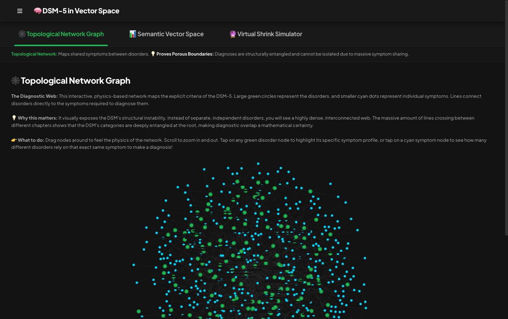
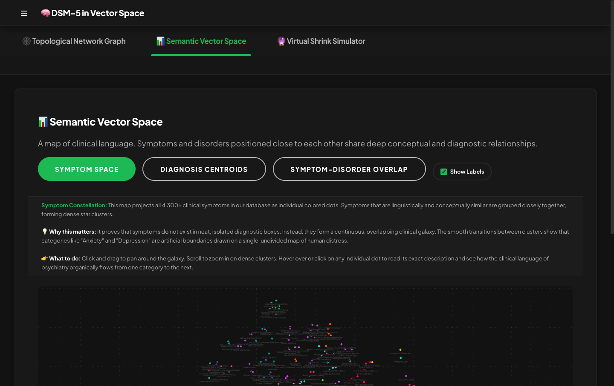
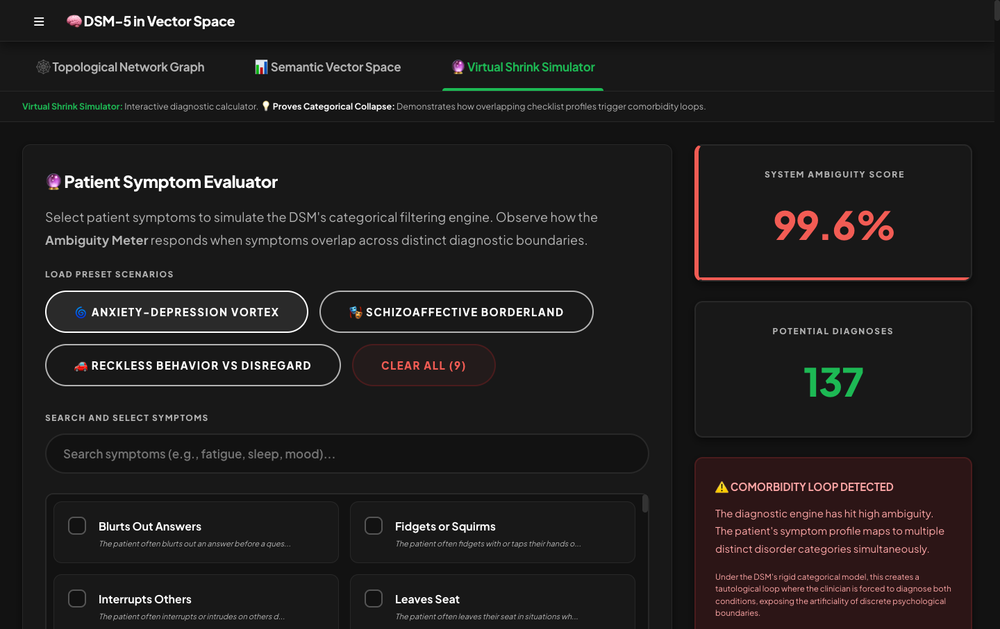

# DSM-5 Hierarchical Symptom Database & Utilities

Author: [Lee Boonstra](https://www.leeboonstra.dev)

---

## 🧠 HYPOTHESIS

As a software engineer, I look at classification systems through the lens of data architecture, relational integrity, and decision trees. 

When we look at traditional physical medicine, diagnostics are built on **discrete, biologically isolated decision trees**. For example, determining whether a patient has a **Common Cold vs. COVID-19** is a binary, biological classification: you either have the rhinovirus or the SARS-CoV-2 virus. The diagnostic boundaries are clear, mutually exclusive, and physically verifiable.

In contrast, **psychiatry's DSM-5-TR is built on a categorical classification model that completely lacks biological boundaries**. It defines disorders not by unique pathology, but as arbitrary checklists of overlapping, descriptive symptoms. 

### The Problem: Porous Boundaries & Tautological Loops
Because distinct diagnostic categories share identical symptom definitions (e.g., fatigue, sleep disturbances, concentration difficulties), the boundaries between disorders are porous and fundamentally entangled. This creates massive **comorbidity overlaps** and **tautological loops** (such as the "Anxiety-Depression Vortex"), where a clinician is mathematically forced to diagnose a patient with multiple conditions simultaneously.

I believe this proves that the DSM's categorical boundaries are artificial. Instead of reflecting discrete medical realities, the DSM forces fluid clinical presentations into rigid, overlapping boxes.

### 📊 Live Interactive Proof
I have built an **interactive data science visualizer** to map, calculate, and prove this hypothesis using the semantic geometry of the DSM-5. 

You can interact with the live proof and run the simulations here:
👉 **[https://savelee.github.io/dsm-in-vector-space/](https://savelee.github.io/dsm-in-vector-space/)**

The application features:
1. **Topological Network Graph**: A live physics-based network mapping shared symptom nodes between disorder nodes, showing the porous structural overlap.
   
2. **Semantic Vector Space**: A 2D projection of clinical description embeddings mapped on a clean, dense blueprint grid. Points closer together share deep linguistic context, proving the semantic entanglement.
   
3. **Virtual Shrink Simulator**: A live diagnostic engine that calculates overlapping symptom profiles and triggers a **"Comorbidity Loop Warning"** when the categorical model collapses under high ambiguity.
   

---

This repository contains the structured JSON datasets representing the DSM-5-TR classification of mental disorders, along with database schemas, vector embedding utilities, and tools to parse, list, and validate diagnostic symptoms.

## License & Attribution

This project and its datasets are licensed under the **Creative Commons Attribution 4.0 International (CC BY 4.0)** License. 

### How to Attribute
If you use this dataset or code in your own project, website, research, or application, you **must** provide attribution by linking back to the author's name and website:

> **DSM-5-TR JSON Database** by [Lee Boonstra](https://www.leeboonstra.dev) (licensed under [CC BY 4.0](https://creativecommons.org/licenses/by/4.0/))

For details, see the full [LICENSE](LICENSE) file.

---

## DSM-5-TR Diagnostic Data Index

The core datasets are organized in the official DSM-5 diagnostic chapter order under the `data/` directory.

### Official Chapter Datasets

| Chapter | DSM-5-TR Chapter Title | JSON Data File |
| :--- | :--- | :--- |
| **Chapter 1** | Neurodevelopmental Disorders | [`neurodevelopment_disorders.json`](./data/neurodevelopment_disorders.json) |
| **Chapter 2** | Schizophrenia Spectrum and Other Psychotic Disorders | [`psychotic_disorders.json`](./data/psychotic_disorders.json) |
| **Chapter 3** | Mood Disorders | [`mood_disorders.json`](./data/mood_disorders.json) |
| **Chapter 4** | Anxiety Disorders | [`anxiety_disorders.json`](./data/anxiety_disorders.json) |
| **Chapter 5** | Obsessive–Compulsive and Related Disorders | [`obsessive_compulsive_disorders.json`](./data/obsessive_compulsive_disorders.json) |
| **Chapter 6** | Trauma- and Stressor-Related Disorders | [`trauma_and_stressor_disorders.json`](./data/trauma_and_stressor_disorders.json) |
| **Chapter 7** | Dissociative Disorders | [`dissociative_disorders.json`](./data/dissociative_disorders.json) |
| **Chapter 8** | Somatic Symptom and Related Disorders | [`somatic_symptom_disorders.json`](./data/somatic_symptom_disorders.json) |
| **Chapter 9** | Feeding and Eating Disorders | [`feeding_and_eating_disorders.json`](./data/feeding_and_eating_disorders.json) |
| **Chapter 10** | Elimination Disorders | [`elimination_disorders.json`](./data/elimination_disorders.json) |
| **Chapter 11** | Sleep–Wake Disorders | [`sleep_wake_disorders.json`](./data/sleep_wake_disorders.json) |
| **Chapter 12** | Sexual Dysfunctions | [`sexual_dysfunctions.json`](./data/sexual_dysfunctions.json) |
| **Chapter 13** | Gender Dysphoria | [`gender_dysphoria.json`](./data/gender_dysphoria.json) |
| **Chapter 14** | Disruptive, Impulse-Control, and Conduct Disorders | [`disruptive_conduct_disorders.json`](./data/disruptive_conduct_disorders.json) |
| **Chapter 15** | Substance-Related and Addictive Disorders | [`substance_related_disorders.json`](./data/substance_related_disorders.json) |
| **Chapter 16** | Cognitive Disorders | [`cognitive_disorders.json`](./data/cognitive_disorders.json) |
| **Chapter 17** | Personality Disorders | [`personality_disorders.json`](./data/personality_disorders.json) |
| **Chapter 18** | Paraphilic Disorders | [`paraphilic_disorders.json`](./data/paraphilic_disorders.json) |

### Core Consolidated & Reference Datasets

| Dataset Description | JSON Data File |
| :--- | :--- |
| **Combined Diagnoses Master** | [`diagnoses.json`](./data/diagnoses.json) |
| **Consolidated Unique Symptoms** | [`unique_symptoms.json`](./data/unique_symptoms.json) |
| **Pre-computed Vector Embeddings** | [`embeddings_text_embedding_005.json`](./embeddings/embeddings_text_embedding_005.json) |

---

## Database Schemas & Migrations

A set of database migrations and models is available in the [`db/`](./db/) directory to help you load and validate the diagnostic data in production applications:
* **Relational Schema (SQL)**: A fully normalized 3NF PostgreSQL schema ([`db/schema.sql`](./db/schema.sql)) separating chapters, diagnoses, and symptoms.
* **Document Schema (JSON)**: A standard JSON Schema ([`db/schema.json`](./db/schema.json)) and TypeScript definitions ([`db/schema.ts`](./db/schema.ts)) validating the improved, strongly-typed document format.
* **Python Models**: Python `dataclass` models ([`db/models.py`](./db/models.py)) providing out-of-the-box parsing and automatic conversion of legacy payloads.

See the [Database Schema README](./db/README.md) for detailed Entity-Relationship diagrams and getting started guides.

---

## Local Vector Embeddings Cache

The repository includes an optimized utility script to pre-compute vector embeddings for all diagnoses and symptoms using state-of-the-art clinical text embedding models. Committing these vectors to GitHub saves API latency and costs for other developers.

To run the embedding generator on your local machine:
1. **Install SDK Dependencies**:
   ```bash
   make init-embeddings
   ```
2. **Generate the Embedding Cache**:
   Provide your active Cloud Project ID:
   ```bash
   make generate-embeddings PROJECT_ID=your-project-id
   ```
   This will generate a single optimized local vector lookup file at `embeddings/embeddings_text_embedding_005.json`.

---

## Setup & Installation

### Requirements

* Python 3.12+
* `uv` package manager

### Setup

Initialize the virtual environment and install the development dependencies:

```bash
make init
```

---

## Code Quality & Testing

### Running Tests

To run the unit test suite:

```bash
make test
```

### Format & Lint

To check and enforce PEP 8 coding standards:

```bash
make format
make lint
```

---

## 📊 Live Interactive Web Client (React + TypeScript + Vite)

This is a pure client-side, touch-optimized, PWA-enabled web application. It runs 100% in the browser and requires **no server-side running backend**, making it perfect for free static hosting (like GitHub Pages, Vercel, or Firebase Hosting).

### Setup & Running Locally

1. **Install Dependencies**:
   ```bash
   make init-modern-viz
   ```
2. **Run Local Development Server**:
   ```bash
   make run-modern-viz
   ```
   This starts the local development server at `http://localhost:5173/`.
3. **Build Static Bundle**:
   ```bash
   make build-modern-viz
   ```
   This compiles the application into an optimized static `modern-viz/dist/` folder, ready for free instant hosting.


