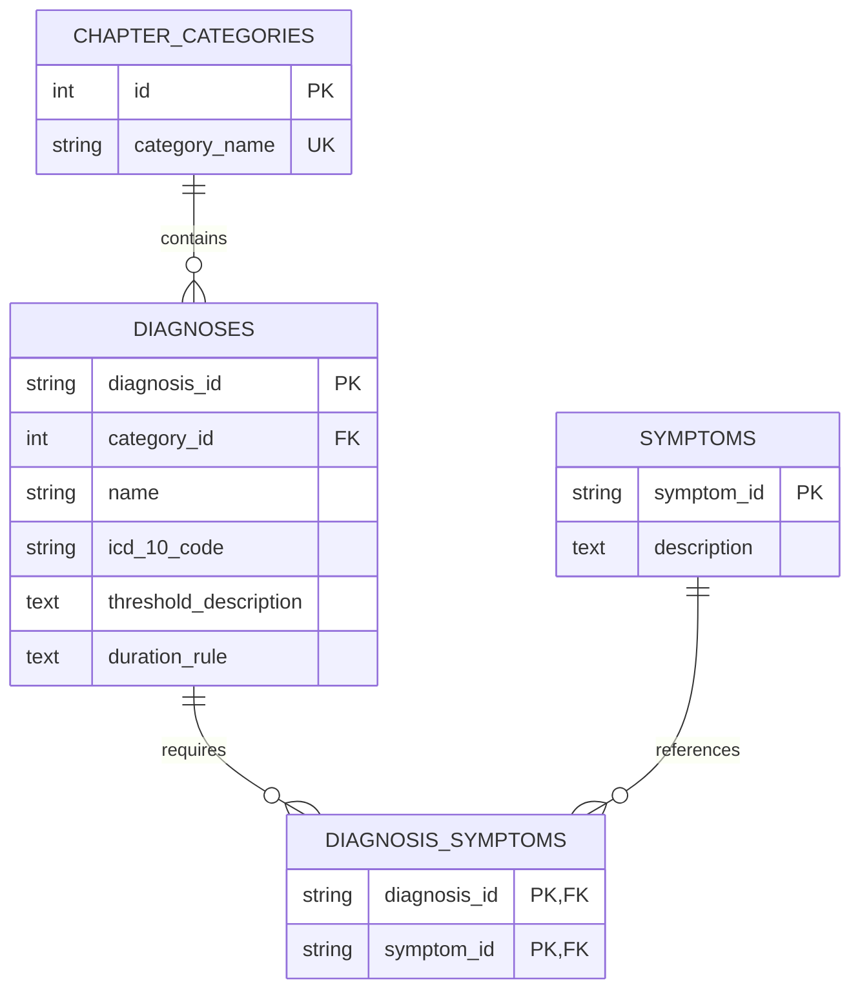

# DSM-5 Database Schemas

This folder contains the database schema specifications for migrating and working with the DSM-5 diagnostic data. It includes support for both relational (SQL) and document (NoSQL) database designs.

## Database Models

### 1. Relational Database Schema (SQL)
To migrate the hierarchical JSON files to a relational database, the data has been fully normalized to **Third Normal Form (3NF)**. This design eliminates data redundancy (such as symptoms that appear in multiple diagnoses, like distress rules) and enforces strong referential integrity.

#### Entity Relationship Diagram


* **`schema.sql`**: Contains the PostgreSQL DDL statements to create these tables, indexes, and foreign keys.

### 2. Document Database Schema (JSON)
For document-store databases (e.g., MongoDB, Firestore) or API payload specifications, we have improved the JSON schema by transforming the legacy `symptom_ids` array (an anti-pattern of dynamic key-value pairs) into a strongly-typed `symptoms` array of uniform objects.

* **Legacy format (anti-pattern)**:
  ```json
  "symptom_ids": [
    { "SYM_BPL_DISTRESS": "The symptoms cause clinically important distress..." }
  ]
  ```
* **Modernized format (best practice)**:
  ```json
  "symptoms": [
    {
      "symptom_id": "SYM_BPL_DISTRESS",
      "description": "The symptoms cause clinically important distress..."
    }
  ]
  ```

* **`schema.json`**: Standard JSON Schema (Draft-07) to validate modernized JSON documents.
* **`schema.ts`**: TypeScript definitions for both the relational and document models to ensure type safety in frontend or backend code.

### 3. Python Integration Models
To bridge the database models with Python backends (like Flask), we provide:
* **SQLAlchemy ORM Models**: Replicating the relational database schema in pythonic code.
* **Pydantic Validation Schemas**: Supporting request/response body validation and automatic parsing of legacy `symptom_ids` data into the modernized format.

* **`models.py`**: Implementation of the SQLAlchemy models and Pydantic validators.

---

## Getting Started

### Relational Migration
To load the DSM-5 diagnostic data into PostgreSQL:
1. Initialize the tables using `schema.sql`.
2. Parse the JSON source files using Python.
3. Insert the unique chapter categories into `chapter_categories`.
4. Insert the unique symptoms into `symptoms`.
5. Insert the diagnoses into `diagnoses` and populate the many-to-many relationship in `diagnosis_symptoms`.

### Validating with Pydantic
The Pydantic model `DSM5DiagnosisSchema` in `models.py` contains a custom validator that dynamically detects if a JSON payload is in the legacy format and converts it to the modernized, type-safe format:

```python
from db.models import DSM5DiagnosisSchema
import json

# Legacy JSON string
legacy_json = '''{
  "diagnosis_id": "DX_ASD",
  "diagnosis_name": "Autism Spectrum Disorder",
  "diagnostic_code": "F84.0",
  "chapter_category": "Neurodevelopmental Disorders",
  "threshold_count": "3/3 social communication...",
  "duration_rule": "Symptoms present from early childhood",
  "symptom_ids": [
    { "SYM_ASD_COMM_RECIPROCITY": "Deficits in social-emotional reciprocity..." }
  ]
}'''

# Parsing automatically normalizes and validates the schema!
diagnosis = DSM5DiagnosisSchema.model_validate_json(legacy_json)
print(diagnosis.symptoms[0].symptom_id)  # "SYM_ASD_COMM_RECIPROCITY"
print(diagnosis.symptoms[0].description)  # "Deficits in social-emotional reciprocity..."
```
